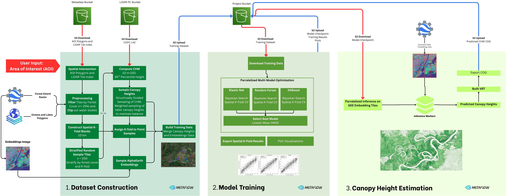

# 🌲CanopyFlow🌲
### ML-driven Tree Canopy Height Estimation Pipeline


End-to-end metaflow pipeline for estimating tree canopy height across large areas [Google AlphaEarth Satellite Embeddings](https://developers.google.com/earth-engine/datasets/catalog/GOOGLE_SATELLITE_EMBEDDING_V1_ANNUAL) using airborne LiDAR Point Clouds as ground-truth.

Read the Case Study [HERE](docs/CASESTUDY.md).




### Three Flows for Generating Custom Canopy Height Maps
1. [**Dataset Construction**](flows/construct_dataset.py) - downloading LiDAR point clouds from AWS S3, compute CHM, structurally guided sampling of tree canopy height. Sampling GEE satellite embeddings 
2. [**Training**](flows/train.py) - regression model training (Elastic Net, Random Forest and XGBoost) with Spatial K-fold Cross Validation. Automated model selection.
3. [**Inference**](flows/inference.py) - predict tree canopy height across your AOI using best model checkpoint. 


## Getting Started with Conda

**Prerequisites:**
- Conda installation [[instructions here]](https://www.anaconda.com/download)
- AWS Account with AWS CLI installed and configured [[instructions here](https://docs.aws.amazon.com/cli/latest/userguide/getting-started-install.html)]
- GEE Service Account [[instructions here]](#setting-up-gee-api-access)

```bash
# Clone repository
git clone https://github.com/medo-younes/canopy-height-ml-flow.git

## Create and Activate Conda Environment
conda env create -f environment.yaml
conda activate canopy-flow

## Dataset Construction
python flows/construct_dataset.py run --max-workers 3 --max-num-splits 4000  --tile-index-path s3://canopy-flow-data/canelevation/tile_index.parquet --sites-path s3://canopy-flow-data/canelevation/sites.parquet --output_dir projects

## Model Training - use metaflow Run ID from dataset preparation flow
python flows/train.py run --max-workers 3 --max-num-splits 4000 --s3-bucket canopy-flow-data 

## Inference - use path to best model checkpoint 
python flows/inference.py run --max-workers 8 --max-num-splits 8000 --model-checkpoint <MODEL-CHECKPOINT-PATH>
```

## Getting Started with Docker

**Prerequisites:**
- Docker Desktop [[instructions here](https://www.docker.com/products/docker-desktop/)]
- AWS Account with AWS CLI installed and configured [[instructions here](https://docs.aws.amazon.com/cli/latest/userguide/getting-started-install.html)]
- GEE Service Account [[instructions here]](#setting-up-gee-api-access)

```bash
# Build the docker image
docker build -t canopy-flow .

# Export AWS Credentials to environment
eval "$(aws configure export-credentials --profile default --format env)"

# Dataset construction flow with Docker
docker run -e AWS_ACCESS_KEY_ID=$AWS_ACCESS_KEY_ID \
           -e AWS_SECRET_ACCESS_KEY=$AWS_SECRET_ACCESS_KEY \
           -e AWS_SESSION_TOKEN=$AWS_SESSION_TOKEN \
            myounes88/canopy-flow:test python construct_dataset.py run --max-workers 3 --max-num-splits 4000


## Training Flow with Docker
docker run -e AWS_ACCESS_KEY_ID=$AWS_ACCESS_KEY_ID \
           -e AWS_SECRET_ACCESS_KEY=$AWS_SECRET_ACCESS_KEY \
           -e AWS_SESSION_TOKEN=$AWS_SESSION_TOKEN \
            myounes88/canopy-flow:test python train.py run --max-workers 3 --max-num-splits 4000 --experiment-id a19fc055-f5ed-4941-a29c-c76e68ba9238


## Predict Canopy Height with Docker
docker run -e AWS_ACCESS_KEY_ID=$AWS_ACCESS_KEY_ID \
           -e AWS_SECRET_ACCESS_KEY=$AWS_SECRET_ACCESS_KEY \
           -e AWS_SESSION_TOKEN=$AWS_SESSION_TOKEN \
            myounes88/canopy-flow:test python inference.py run --max-workers 3 --max-num-splits 4000 --experiment-id a19fc055-f5ed-4941-a29c-c76e68ba9238
```


## Setting Up GEE API Access

1. Export a GEE Service Account Key JSON file by [following these instructions](https://gee-documentation.readthedocs.io/en/latest/authentication/service-account-auth.html).
2. Create an .env file in the project root directory and include your GEE service account email and the path to your GEE Service Account Key (JSON)

```bash
GEE_SERVICE_ACCOUNT_EMAIL=<YOUR-GEE-SERVICE-ACCOUNT-EMAIL>
GEE_SERVICE_ACCOUNT_KEY_PATH=<PATH-TO-YOUR-GEE-SERVICE-ACCOUNT-KEY>
```

## Using your Own LiDAR Data

The current workflow is currently integrated with the [CanElevation Series Dataset](https://open.canada.ca/data/en/dataset/7069387e-9986-4297-9f55-0288e9676947)

To run this pipeline on your own data you will need:
- **S3-hosted LiDAR Point Clouds** - your own [COPC](https://copc.io/) files hosted on AWS S3
- **Tile Index** - indicating the spatial bounds of each point cloud, including its S3 URI or URL
- **Google Earth Engine Account** with a valid service account key for programmatic access via Python API
- **AOI Polygon Boundary** AOI in GeoParquet format


## References

This work is largely inspired by [Google Earths Medium Post](https://medium.com/google-earth/improved-forest-carbon-estimation-with-alphaearth-foundations-and-airborne-lidar-data-af2d93e94c55) written by John B. Kilbride
