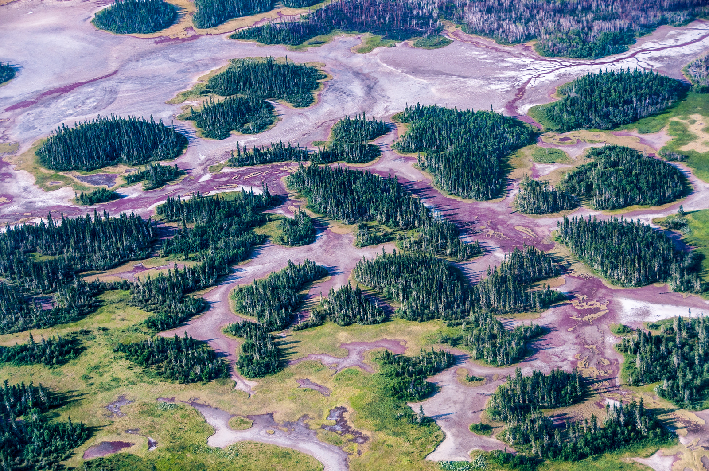
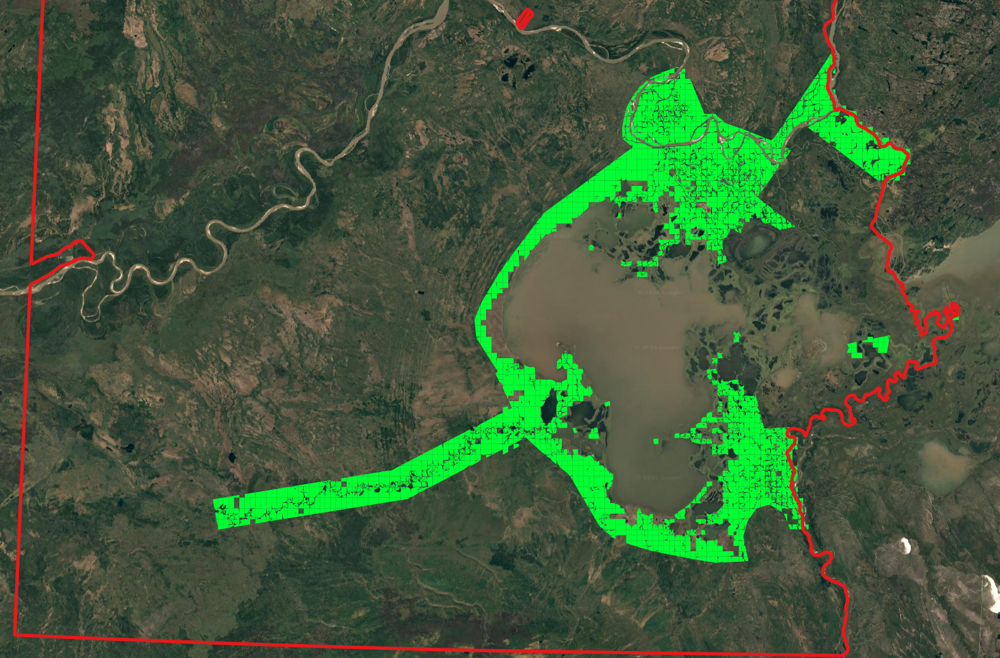
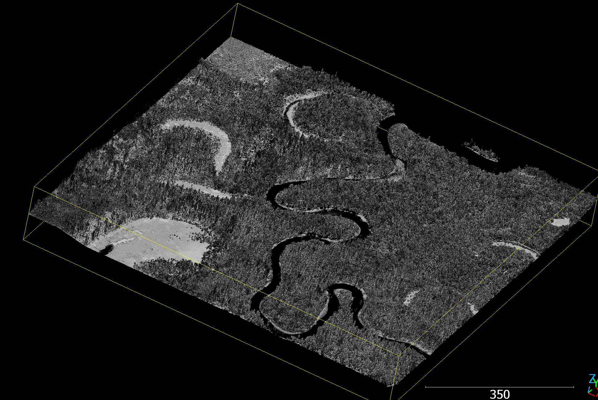
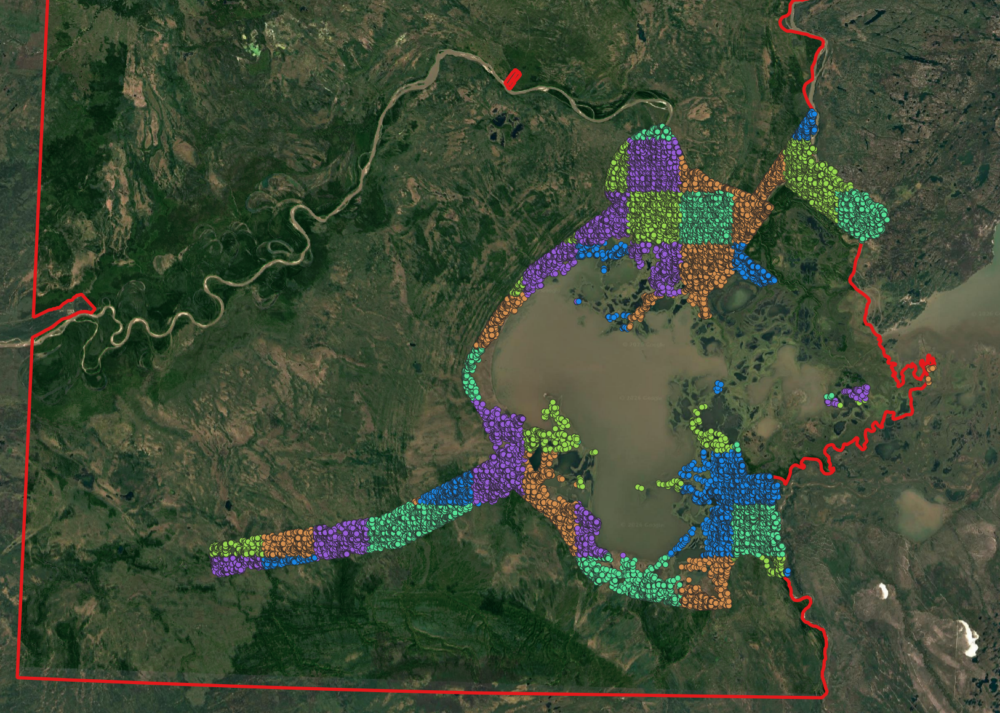
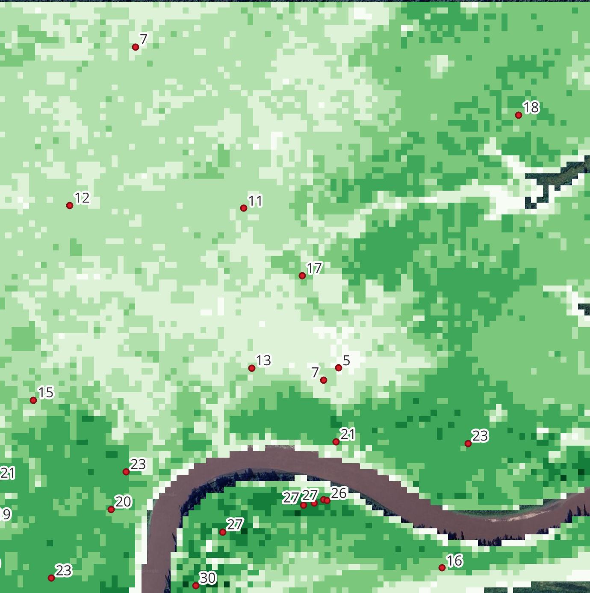
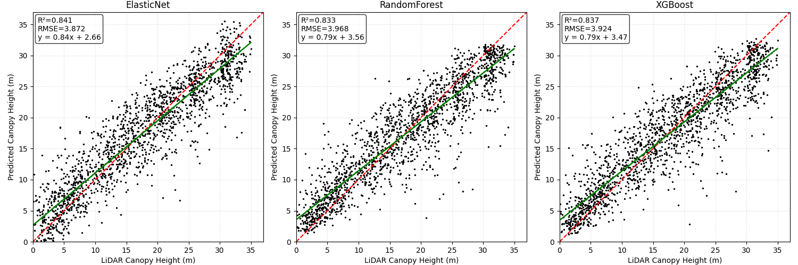
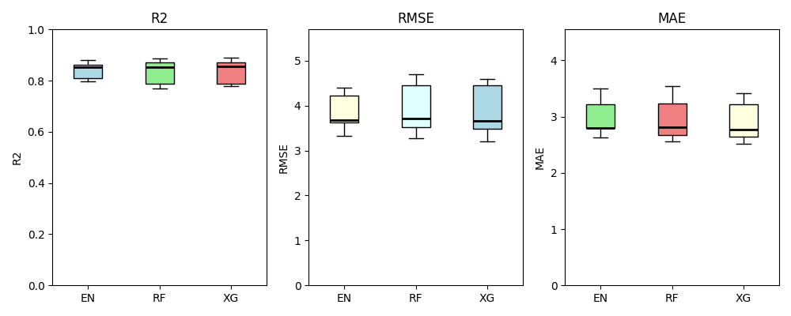

# Case Study: Wood Buffalo National Park of Canada

Forest canopy height is a key variable in estimating aboveground biomass and carbon sequestration. Capturing accurate tree height data can be achieved with airborne or UAV-based LiDAR, however cost-constraints make it challenging to attain wall-to-wall canopy height models (CHMs) of large areas using this technology. Scaling up forest canopy height modelling can be treated as a regression problem by combining LiDAR-derived CHMs as the target variable, while using globally available and continuous satellite data as predictors. Current approaches construct predictor variables using optical and radar imagery, which can require a lot of preprocessing to feed into a model. Geospatial foundational models can produce powerful embeddings, helping scientists bypass tedious feature engineering and to focus on model development. By leveraging Google Earth Engine's (GEE) satellite embeddings dataset, you can easily construct a stack of 64 feature-rich predictor variables for forest canopy height estimation with strong results.

To exhibit the pipeline's scalability, a case study was implemented on Canada's largest national park; [Wood Buffalo National Park](https://en.wikipedia.org/wiki/Wood_Buffalo_National_Park). Situated in northeastern Alberta, Wood Buffalo National Park covers 44,741 km2, an area larger than Switzerland, making it the second-largest national park in the world. Using publicly available data, a canopy height estimation model was developed for the major national park.
 

## Extracting Canopy Heights and Satellite Embeddings

With the end goal of constructing a training dataset including sampled forest canopy height as the target variable and 64 AlphaEarth Satellite Embeddings as predictor variables, a [metaflow](https://metaflow.org/) was developed.

Airborne LiDAR Point Clouds were utilized as ground-truth canopy height data for the study area. The [CanElevation Series](https://open.canada.ca/data/en/dataset/7069387e-9986-4297-9f55-0288e9676947) is a publicly available LiDAR Point Cloud dataset produced by Natural Resources Canada (NRCan). There is wide coverage across major Canadian cities and natural sites, making it an extremely valuable elevation dataset for the country. Made available as Cloud Optimized Point Clouds (COPC) on AWS S3, CanElevation Series enables fast spatial querying of point cloud data. It comes with a 1 x 1 km tile index, including the spatial boundaries of each COPC file, project metadata (including acquisition year) and its S3 URL. 

The first step is to retrieve the tiles overlapping the area of interest (AOI) using as simple spatial join. The intersection amounted to 3,536 tiles. Next, the intersecting tiles were filtered based on forest cover (>=25%) using a [global raster of natural and planted forest extent on GEE](https://gee-community-catalog.org/projects/global_ftype/) (Xiao, Y., 2024). Water bodies (oceans and lakes) were clipped out from tile geometries with the help of [Overture's globally available water features dataset](https://docs.overturemaps.org/schema/reference/base/water/). As a result, the post processed tiles ensure that only forested areas are sampled, while avoiding the sampling of water. Following these preprocessing steps, a total of 2,240 tiles covering 1,813 km2 remained; only ~4% of the study area.

 

Before sampling canopy heights, the tile index is allocated to a spatial block for spatial cross-validation (spatial CV) and then subsampled to avoid downloading thousands of COPCs. A 5-fold 10 x 10 km spatial block grid was constructed using the [spatial-kfold library](https://github.com/WalidGharianiEAGLE/spatial-kfold), intersecting tiles then inherit the fold ID. The tile index is then subsampled, 20 tiles are sampled from each fold ID and forest cover stratum (5-meter bins), resulting in subset of tiles representative of the spatial extent and forest cover across the site. By employing spatial CV, models are evaluated on their ability to learn meaningful patterns across space, ensuring robustness against spatial autocorrelation and can generalize across unseen regions (Ploton et al., 2020).

 

Now the point clouds are ready for sampling. Using metaflow's parallelization capabilities, LiDAR point clouds are downloaded, preprocessed, and sampled in parallel, optimizing workflow speed.

The canopy height sampling methodology follows a Structurally Guided Sampling (SGS) approach, where structural stratification—in this case canopy height—informs where samples are taken across the site (Goodbody et al., 2023). First, a Canopy Height Model (CHM) is computed from the raw point clouds by attaining the 95th percentile in Height Above Ground (HAG) at 10-meter resolution. The CHM is stratified into 5-meter bins, deriving the regions from which random point samples are generated.

Furthermore, a weighted sampling approach is applied, whereby areas with taller canopy heights are sampled more frequently than low or average canopy heights. Since tall canopies occur less frequently, weighted sampling ensures they are appropriately represented in the dataset, allowing the model to estimate tall canopy heights with greater accuracy.

 

Once canopy heights have been sampled, the next step is to extract Satellite Embeddings from GEE. The GEE Python API is used to retrieve the GEE Satellite Embeddings image corresponding to the LiDAR data's acquisition year, in this case, 2019. The sample point geometries are uploaded to GEE to extract 64 embedding values for it's corresponding pixel. The embeddings are then downloaded and merged with the canopy height data. Point samples inherit the fold ID from the spatial blocks generated earlier to construct the final training dataset.

 

## Multi-Model Optimization

Three powerful regression models were evaluated on outputted dataset; Elastic Net, Random Forest and XGBoost. Elastic Net is an extension of the classic linear regression model, including regularization mechanisms to reduce overfitting. Random forest is a popular ML algorithm, an ensemble of decision trees that learn meaningful decision boundaries from the data, the final prediction is a combination of the output from all decision trees in the random forest. XGBoost is a gradient boosting algorithm (add more). 

Each model is trained and tested on all five folds using the [OptunaSearchCV](https://optuna.readthedocs.io/en/v2.0.0/reference/generated/optuna.integration.OptunaSearchCV.html) method. Using the mean Root Mean Squared Error (RMSE) across all folds as the objective function, a Bayesian hyperparameter search with 30 trials is implemented to obtain the best model parameters for the training dataset.

Despite models attaining similarly high R2 scores of >0.80, Elastic Net achieved the highest performance; R² = 0.841 ± 0.035 | RMSE = 3.851 ± 0.44m. Low error variability suggests that the model performed well across all folds, indicated strong spatial generalization capability. 

## Predicting Canopy Height

## References

1. Goodbody, T. R. H., Coops, N. C., Queinnec, M., White, J. C., Tompalski, P., Hudak, A. T., Auty, D., Valbuena, R., LeBoeuf, A., Sinclair, I., McCartney, G., Prieur, J.-F., & Woods, M. E. (2023). sgsR: A structurally guided sampling toolbox for LiDAR-based forest inventories. Forestry, 96(4), 411–424. https://doi.org/10.1093/forestry/cpac055

2. Ploton, P., Mortier, F., Réjou-Méchain, M., Barbier, N., Picard, N., Rossi, V., Dormann, C., Cornu, G., Viennois, G., Bayol, N., Lyapustin, A., Gourlet-Fleury, S., & Pélissier, R. (2020). Spatial validation reveals poor predictive performance of large-scale ecological mapping models. Nature Communications, 11(1), 4540. https://doi.org/10.1038/s41467-020-18321-y

3. Xiao, Y. (2024). Global Natural and Planted Forests Mapping at Fine Spatial Resolution of 30 m [Data set].
Zenodo. https://doi.org/10.5281/zenodo.10701417

